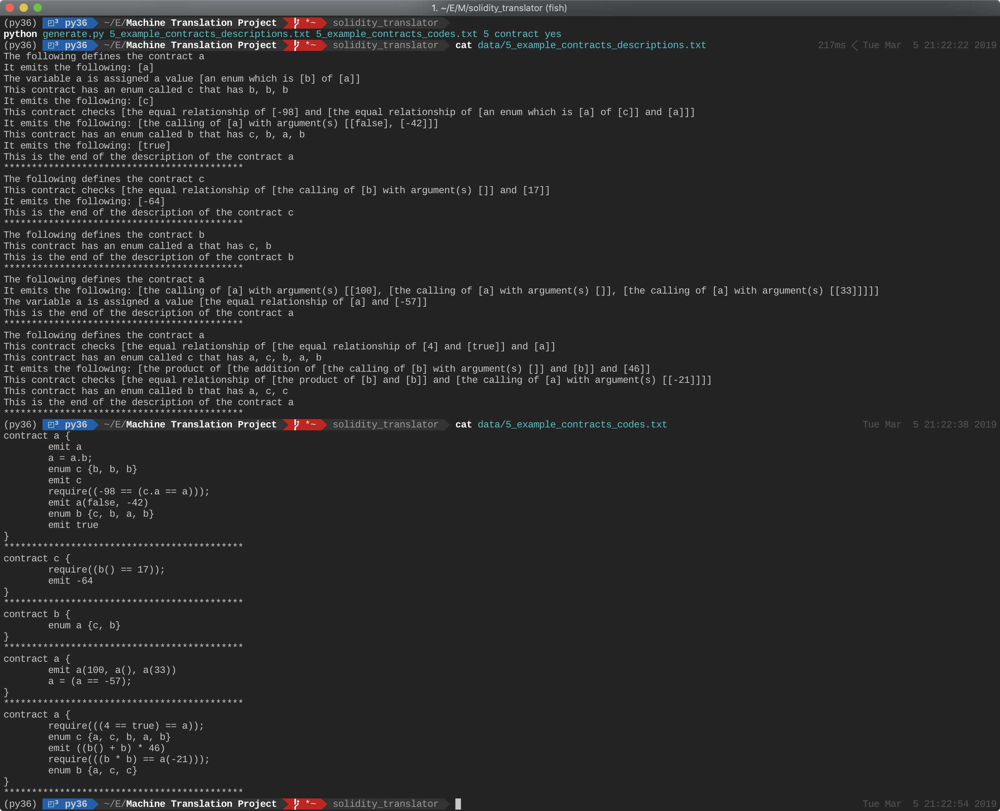

# Solidity Translator

#### Wang, Ning. She, Zuohao.

## Overview


Please note that this project is by far only a **prototype** or a **proof of concept**. It does not support all features the language solidity does. For example, only integer is supported at the moment for atomic values. I.e. there is no boolean value or string etc. supported.*

Above is an image demonstrating how to use this rudimentary translator that can translate a relatively restricted text in English into the code solidity to define a smart contract. The translation can be done in two methods: by rule or through the usage of a transformer obtained [here](https://github.com/jadore801120/attention-is-all-you-need-pytorch). 

The rudimentary English text and the corresponding solidity code to train the transformer are generated together using the python script `generate.py` The generated files will be inside the `training_data` directory. An example usage is given below. 

```
python generate.py 5_example_contracts_descriptions.txt \ 5_example_contracts_codes.txt 5 contract yes
```

The image below shows the output of the above command. 



The generated contracts are random. The dimension of the input names however is limited to only several alphabetic letters.

The templates used to randomly generate the English texts and solidity codes are located in `solidity_translator/src/language_rules`. In this directory, there are two main classes: `Expression` and `Template`. Whereas an `Expression` is only something basic such as variable names or numerical operations, etc., a template can be as simple as a variable definition or as complicated as a definition of a function or even a whole contract. In addition, note how the expressions in the descriptions are surrounded by square brackets. This is a simplification so that during rule based translation, it is easier to manually parse the description texts and to generate the corresponding codes. 


